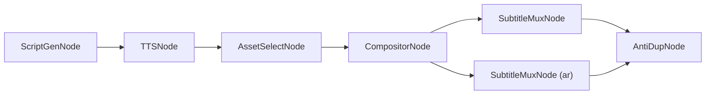

# 📐 ClipFlow — PROJECT ROADMAP

> **多语言视频内容工厂 · Multilingual Video Content Factory**
>
> 本文档是 ClipFlow 项目的**宪法级纲领**，所有后续开发均以此为准。
> 最后更新：2026-03-06

---

## 目录

1. [项目定位 (Mission)](#1-项目定位-mission)
2. [核心架构原则 (Core Architecture Principles)](#2-核心架构原则-core-architecture-principles)
3. [目录结构 (Project Layout)](#3-目录结构-project-layout)
4. [核心数据模型 (Key Data Models)](#4-核心数据模型-key-data-models)
5. [阶段实施规划 (Execution Phases)](#5-阶段实施规划-execution-phases)
6. [技术红线 (Hard Constraints)](#6-技术红线-hard-constraints)

---

## 1. 项目定位 (Mission)

ClipFlow 是一个面向**中东及全球市场**的多语言短视频批量生产系统。

| 维度 | 描述 |
|------|------|
| **核心能力** | 多轨道混剪 → 母带生成 → 多语言字幕挂载 → 批量变体分发 |
| **目标用户** | 跨境 MCN / 本地化团队 / AI Agent |
| **差异壁垒** | FFmpeg 原生槽位渲染 + DAG 工作流编排 + Master-Variant 流式出片 |

> [!IMPORTANT]
> **战略定位 — 纯粹的高并发底层渲染引擎 (Headless Render Engine)**
>
> ClipFlow 致力于提供**纯粹的音视频渲染管线**。本系统**不包含**复杂的社交媒体抓取与自学习逻辑，而是通过标准化的 **Headless API** 向外暴露全部渲染能力，以便未来无缝接入上层的「**业务增长中枢系统 (GrowthOS)**」。
> ClipFlow 的边界是：接收结构化任务指令 → 完成高质量渲染 → 返回带指纹与成本估算的结果报告。业务决策、数据学习、爆款分析等高阶逻辑，由 GrowthOS 负责。

---

## 2. 核心架构原则 (Core Architecture Principles)

### 2.1 运行模式 — B/S Local First

```
┌─────────────────────────────────────────┐
│  Browser UI (Vue / React)               │  ← 未来可替换为云端前端
│  ↕  HTTP / WebSocket                    │
│  FastAPI Backend (本地进程)              │  ← 未来可直接部署为云 API
│  ↕                                      │
│  WorkflowEngine + FFmpeg (本地算力)      │  ← 核心渲染永远在本地
└─────────────────────────────────────────┘
```

- 所有核心视频渲染、节点流转在**本地**执行
- UI 层通过标准 HTTP / WebSocket 与后端通信
- 架构天然保留**云端化 / API 化**的迁移路径

#### 场景说明 (Use-Case Scenarios)

| 场景 | 终端 | 操作描述 |
|------|------|----------|
| **C 端 · 极速轻量** | 手机端 | 用户用手机拍摄库存或门店实录视频，上传后云端引擎自动融合 AI 素材，一键混剪出片，全程无需专业技能 |
| **B 端 · 深度矩阵** | 桌面端 | 运营人员在桌面端拉满本地电脑算力，进行深度的 X/Y 轴多维编排，并行启动多进程矩阵，极速批量裂变变体 |

### 2.2 工作流引擎 — DAG Workflow



- **抛弃线性脚本**，全部能力封装为 `BaseNode` 子类
- `WorkflowEngine` 负责 DAG 拓扑排序 → 依次/并行调度节点
- 数据通过 `WorkflowContext` 这条统一数据总线在节点间流转

### 2.3 多语言母带模式 — Master-Variant

```
Master Video (无字幕纯净画面)
  ├── + zh.ass  →  中文变体 .mp4
  ├── + ar.ass  →  阿拉伯语变体 .mp4 (RTL)
  ├── + en.ass  →  英语变体 .mp4
  └── + ...     →  任意语言变体
```

> [!CAUTION]
> **绝对禁止**将字幕硬编码烧录进视频像素。必须通过 `-c:s copy` 或流式 mux 方式挂载 `.ass` 软字幕/外挂字幕。

### 2.4 多维混剪与槽位渲染 — X/Y Axis & Slot-based Rendering

这是 ClipFlow 的**核心竞争壁垒**。

#### Timeline 数据结构（二维模型）

| 轴 | 含义 | 示例 |
|----|------|------|
| **X 轴 (Time)** | 时间线推进 — 片段顺序拼接 | Clip A → Clip B → Clip C |
| **Y 轴 (Layer)** | 空间图层叠加 — 从底到顶 | Layer 0: 底层视频 / Layer 1: 特效 / Layer 2: 贴纸 |

```
Y (Layer)
│  ┌──────┐          ┌────┐
│2 │Sticker│          │Logo│        ← 顶层贴纸/水印
│  └──────┘          └────┘
│  ┌───────────────────────────┐
│1 │    Overlay / VFX           │    ← 中层特效
│  └───────────────────────────┘
│  ┌──────────┐┌──────┐┌──────┐
│0 │  Clip A   ││Clip B ││Clip C│    ← 底层视频素材
│  └──────────┘└──────┘└──────┘
└─────────────────────────────────→ X (Time)
```

#### FFmpeg 槽位 (Slot) 渲染模式

```bash
# 概念示例 — Timeline → FFmpeg Complex Filtergraph
ffmpeg \
  -i clip_a.mp4      \   # [0:v] → slot v0
  -i clip_b.mp4      \   # [1:v] → slot v1
  -i overlay.png      \   # [2:v] → slot v2
  -filter_complex "
    [0:v][1:v] concat=n=2:v=1:a=0 [base];
    [base][2:v] overlay=x=10:y=10:enable='between(t,2,5)' [out]
  " \
  -map "[out]" master.mp4
```

> [!IMPORTANT]
> **CompositorNode 的职责**：将 `Timeline` 对象**编译**为带 `[v0]`, `[v1]` 等动态输入槽位的 FFmpeg 命令流，而非逐帧操作。

> [!CAUTION]
> **严禁引入 `moviepy` 等逐帧处理库。** 所有视频合成必须通过 FFmpeg 原生命令完成。

---

## 3. 目录结构 (Project Layout)

```
ClipFlow/
├── PROJECT_ROADMAP.md          ← 本文档（宪法）
├── requirements.txt
├── main.py                     ← 入口 / FastAPI 启动
│
├── src/
│   ├── core/                   ← 引擎核心
│   │   ├── __init__.py
│   │   ├── context.py          ← WorkflowContext (已完成 ✔)
│   │   ├── base_node.py        ← BaseNode 抽象基类 (已完成 ✔)
│   │   ├── engine.py           ← WorkflowEngine (DAG 调度)
│   │   └── timeline.py         ← Timeline 二维数据结构
│   │
│   ├── nodes/                  ← 业务节点
│   │   ├── __init__.py
│   │   ├── script_gen_node.py  ← LLM 文案生成
│   │   ├── tts_node.py         ← TTS 语音合成
│   │   ├── asset_select_node.py← 素材检索/匹配
│   │   ├── compositor_node.py  ← Timeline → FFmpeg 编译器 [核心]
│   │   ├── subtitle_mux_node.py← .ass 字幕挂载 (Master→Variant)
│   │   └── anti_dup_node.py    ← 去重 / 混淆
│   │
│   ├── ffmpeg/                 ← FFmpeg 封装层
│   │   ├── __init__.py
│   │   ├── command_builder.py  ← Filtergraph 命令构建器
│   │   ├── slot_manager.py     ← 输入槽位管理
│   │   └── runner.py           ← 子进程执行 & 进度回调
│   │
│   ├── localization/           ← 多语言 & RTL
│   │   ├── __init__.py
│   │   └── ass_generator.py    ← .ass 字幕生成（含 RTL 排版）
│   │   # ⚠️ rtl_utils.py 已移除：实战证明 FFmpeg 原生 HarfBuzz 已完美支持 RTL 连写，采用极简透传方案
│   │
│   ├── api/                    ← FastAPI 接口层
│   │   ├── __init__.py
│   │   ├── routes.py           ← REST 端点
│   │   └── schemas.py          ← Pydantic 数据校验
│   │
│   └── utils/                  ← 通用工具
│       ├── __init__.py
│       ├── file_utils.py
│       └── config.py
│
├── tests/                      ← 测试
│   ├── test_engine.py
│   ├── test_timeline.py
│   ├── test_compositor.py
│   └── test_subtitle_mux.py
│
├── assets/                     ← 测试素材 (不入 Git)
│   ├── clips/
│   ├── overlays/
│   └── subtitles/
│
└── web/                        ← 前端 (Phase 5)
    ├── index.html
    └── ...
```

---

## 4. 核心数据模型 (Key Data Models)

### 4.1 WorkflowContext（已实现 ✔）

```python
class WorkflowContext:
    session_id: str
    config: Dict[str, Any]      # 全局配置
    assets: Dict[str, Any]      # 核心资产路径
    variants: Dict[str, Dict]   # 多语言变体 {"ar": {"subtitle_ass": "...", "final_video": "..."}}
```

### 4.2 Timeline（Phase 2 实现）

```python
@dataclass
class ClipItem:
    source: str          # 素材文件路径
    start: float         # 素材内截取起点 (秒)
    duration: float      # 持续时长 (秒)
    layer: int = 0       # 所在图层 (Y 轴)
    position: float = 0  # 在时间线上的放置位置 (X 轴，秒)
    effects: List[str] = field(default_factory=list)  # 应用的滤镜

@dataclass
class Track:
    layer: int                     # 图层编号 (0=底层)
    track_type: str                # "video" | "audio" | "overlay"
    clips: List[ClipItem] = field(default_factory=list)

@dataclass
class Timeline:
    tracks: List[Track] = field(default_factory=list)
    width: int = 1920
    height: int = 1080
    fps: float = 30.0

    def compile_to_ffmpeg(self) -> str:
        """将二维 Timeline 编译为 FFmpeg 复杂滤镜图命令"""
        ...
```

### 4.3 DAG Workflow 定义格式（Phase 1 实现）

```python
# 以 Python dict 定义，未来可序列化为 JSON/YAML
workflow_def = {
    "nodes": {
        "script":    {"type": "ScriptGenNode",   "params": {...}},
        "tts":       {"type": "TTSNode",         "params": {...}},
        "asset":     {"type": "AssetSelectNode", "params": {...}},
        "composite": {"type": "CompositorNode",  "params": {...}},
        "subtitle":  {"type": "SubtitleMuxNode", "params": {...}},
    },
    "edges": [
        ("script", "tts"),
        ("tts", "asset"),
        ("asset", "composite"),
        ("composite", "subtitle"),
    ]
}
```

---

## 5. 阶段实施规划 (Execution Phases)

---

### Phase 1 — 引擎基石与基础节点 (Engine & Basic Nodes)

**目标**：搭建 DAG 工作流引擎骨架，打通简单数据流转闭环。

- [x] 定义 `WorkflowContext` 数据总线 (`src/core/context.py`)
- [x] 定义 `BaseNode` 抽象基类 (`src/core/base_node.py`)
- [x] 实现 `WorkflowEngine` — DAG 拓扑排序与调度 (`src/core/engine.py`)
  - [x] 节点注册 & 边定义
  - [x] 拓扑排序 (Kahn's Algorithm)
  - [x] 顺序执行 & 错误处理
  - [x] 并行执行支持（无依赖节点并发调度）
- [x] 开发 `EchoNode` / `PassthroughNode` 用于单元测试验证引擎闭环
- [x] 编写 `tests/test_engine.py`，覆盖：线性流、分叉流、环检测
- [x] 补充 `WorkflowContext` 的节点级输出存储能力 (`node_outputs`)

---

### Phase 2 — 核心渲染引擎打造 (Timeline & FFmpeg Slot Engine)

**目标**：实现基于 X/Y 轴的二维混剪引擎，完成 Timeline → FFmpeg 编译。

- [x] 设计 & 实现 `Timeline` / `Track` / `ClipItem` 数据结构 (`src/core/timeline.py`)
- [x] 实现 FFmpeg 封装层 (`src/ffmpeg/`)
  - [x] `slot_manager.py` — 输入槽位分配 & 命名 (`[v0]`, `[v1]`, ...)
  - [x] `command_builder.py` — Complex Filtergraph 编译器
    - [x] X 轴拼接：`concat` 滤镜
    - [x] Y 轴叠加：`overlay` 滤镜 (含时间区间 `enable`)
    - [x] 音频轨混合：`amix` / `amerge`
  - [x] `runner.py` — 子进程执行 + 实时进度解析 (`-progress pipe:1`)
- [x] 实现 `CompositorNode` (`src/nodes/compositor_node.py`)
  - [x] 从 `WorkflowContext` 读取 `Timeline` 对象
  - [x] 调用 `command_builder` 编译为 FFmpeg 命令
  - [x] 调用 `runner` 执行并输出 master 视频路径
- [x] 编写 `tests/test_timeline.py` — 数据结构序列化 / 反序列化
- [x] 编写 `tests/test_compositor.py` — 用测试素材验证实际渲染输出

---

### Phase 3 — 内容生成、混合素材调度与多语言适配 (Content, Hybrid Asset Scheduling & Localization) ✅

**目标**：接入 LLM / TTS，实现混合素材动态调度引擎，攻克阿拉伯语 RTL 在 `.ass` 字幕中的排版。

- [x] 实现 `ScriptGenNode` — LLM 文案生成 (`src/nodes/script_gen_node.py`)
- [x] 实现 `TTSNode` — 语音合成 (`src/nodes/tts_node.py`)
- [x] 实现 `AssetSelectNode` — **智能弹药库与 Hook 隔离策略** (`src/nodes/asset_select_node.py`)
  > [!IMPORTANT]
  > **核心商业逻辑升级**：废弃单纯的本地文件夹扫描，改为直接读取本地 SQLite 数据库 (`local_assets_inventory`)。
  > 1. **Hook 隔离**：强制首个镜头抽取 `video_role='hook'` 的黄金片头。
  > 2. **LRU 防疲劳**：采用“最少使用优先”算法抽取混剪骨料 (`body`)，用完后 `usage_count` 自动 +1。
- [x] 实现多语言字幕系统 (`src/localization/`)
  - [x] `ass_generator.py` — 从文案 + 时间戳生成 `.ass`
  - [x] FFmpeg 原生 HarfBuzz 完美支持 RTL，极简透传。
- [x] 实现 `SubtitleMuxNode` (`src/nodes/subtitle_mux_node.py`)
  - [x] Master + .ass → Variant 流式输出 (Test-First 单语种优先渲染)

---

### Phase 4 — 高并发矩阵裂变与防封管线 (High-Concurrency Matrix & Anti-Dup) ✅

**目标**：抛弃单线程线性出片，引入 `ProcessPoolExecutor` 多进程池，彻底压榨本地 CPU 多核算力；结合底层防查重参数，实现批量变体的极速裂变。

- [x] 实现 `MatrixEngine` — 多进程任务调度器 (`src/core/matrix_engine.py`)
- [x] 实现批量任务提交接口 — 纯异步非阻塞 (返回 HTTP 202)
- [x] 实现 `AntiDupNode` (`src/nodes/anti_dup_node.py`)
  - [x] 视觉扰动：微调亮度/对比度/色相
  - [x] 时间扰动：首尾微量裁剪 / 随机变速

---

### Phase 5 — FastAPI 接口层与数据基建 (Headless API & Data Infrastructure) ✅

**目标**：构建标准化的 Headless API 接口层，引入轻量级数据库实现任务流与资产指纹的持久化管理。

#### 5.1 数据库基建 (SQLite / SQLAlchemy) ✅
- [x] 设计并实现 ORM 数据模型 (`src/db/models.py`)
  - [x] `VideoTask` — 任务流记录。
  - [x] `LocalAsset` (`local_assets_inventory`) — 本地 DAM 资产大盘，包含 `file_hash`, `usage_count`, `video_role`, `is_exhausted` 等疲劳度管理字段。

#### 5.2 FastAPI 接口层 (`src/api/`) ✅
- [x] `POST /tasks/submit` — 异步提交渲染任务，立即返回 202。
- [x] `POST /assets/import` — 物理 MD5 防重导入素材。
- [x] `GET /assets/list` — 资产指纹库浏览与状态下发。
- [x] **Webhook 异步回调**：任务完成后向 `WEBHOOK_URL` 推送包含最终视频路径与 Hash 的结案报告。

---

### Phase 6 — Agent & 增长大脑对接 (Headless API)

**目标**：将渲染管线封装为标准化 API，支持「**双向学习**」——允许外部增长大脑 (GrowthOS) 动态向本系统注入最新的转化策略。

#### 6.1 Agent 调用接口 (Outbound — ClipFlow 作为工具)
- [ ] 定义 Agent Tool Schema（OpenAI Function Calling 兼容格式）

#### 6.2 双向学习注入接口 (Inbound — GrowthOS 向 ClipFlow 写入策略)
> [!IMPORTANT]
> **核心设计**：GrowthOS 可通过以下接口，将其从数据分析中习得的最优策略**动态注入**到 ClipFlow，接管本地引擎的抽卡逻辑。

- [ ] `POST /strategies/x_axis_hooks` — 注入 X 轴黄金片头策略（下发高 ROI 素材的 file_hash，强制本地引擎在下次渲染时绝对优先调用该 Hook，接管本地 LRU 算法）。
- [ ] `POST /strategies/overlay_clips` — 注入最新的 Y 轴转化策略（贴纸、Logo 等）。
- [ ] `POST /strategies/prompt_templates` — 注入最新的 LLM Prompt 模板。
- [ ] `GET /strategies/active` — 查询当前生效的策略版本与来源。

---

### Phase 7 — 客户端生态与 PMF 内测版 (Client Ecosystem MVP v1.0) 🚀

**目标**：在不污染底层纯净引擎的前提下，构建面向 B端/C端 客户的交互外壳，完成商业化验证。

#### 7.1 B端重度客户：桌面端矩阵工作站 (Tauri + Vue 3) [状态：v1.0 MVP 封板中]
> **定位**：部署在客户本地电脑，双视图混合架构的「私有化印钞机」。
- [x] **架构升级**：实现“首屏 ROI 看板” + “沉浸式 AI Feed 工作台”的双视图平滑切换。
- [x] **数字资产管理 (DAM)**：独立的素材库面板，可视化展示 X轴/Y轴素材的“疲劳度血条”与“引用次数”，支持设置 Hook 身份。
- [x] **异步无阻塞体验**：前端任务 Feed 流 + 轮询/Webhook 状态更新，告别干等。
- [ ] 打包分发：构建 `.exe` / `.dmg` 独立安装包。

#### 7.2 C端轻量客户：移动端极速投喂 (Telegram/Discord Bot) [状态：新开战线]
> **定位**：面向汽修店老板/买量投放手，移动办公的“极速触角”与 PLG 转化漏斗。
- [ ] **独立微服务**：Node.js + Telegraf/Discord.js 架构。
- [ ] **业务闭环**：接收移动端素材 -> 调用桌面端 API -> 接收 Webhook 拿视频 -> Bot 内原生转发分享。
- [ ] **C 转 B 商业化漏斗**：设置免费产出配额墙，引导高频客户升级“企业版专属桌面主机”。

---

## 6. 技术红线 (Hard Constraints)

> [!CAUTION]
> 以下规则为本项目**不可违反的底线**，任何 PR 违反以下条款必须驳回。

| # | 红线 | 原因 |
|---|------|------|
| 🔴 1 | **禁止引入 `moviepy`** 或任何逐帧处理库 | 性能瓶颈，无法支撑批量生产 |
| 🔴 2 | **禁止将字幕烧录进视频像素** | 破坏 Master-Variant 架构，无法快速生成多语言变体 |
| 🔴 3 | **所有视频合成必须通过 FFmpeg 原生命令** | 保证渲染性能和可控性 |
| 🔴 4 | **所有业务逻辑必须封装为 `BaseNode` 子类** | 保证可编排、可测试、可复用 |
| 🔴 5 | **节点间数据传递必须通过 `WorkflowContext`** | 保证数据流的可追溯性和序列化能力 |
| 🔴 6 | **前后端通过 HTTP/WebSocket 解耦** | 保留云端化迁移路径 |

---

> **This is a living document.** 随着开发推进，各 Phase 的 checkbox 将持续更新。
>
> — ClipFlow Chief Architect · February 2026
