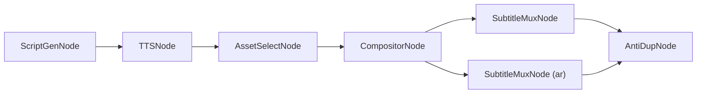

# 📐 ClipFlow — PROJECT ROADMAP

> **多语言视频内容工厂 · Multilingual Video Content Factory**
>
> 本文档是 ClipFlow 项目的**宪法级纲领**，所有后续开发均以此为准。
> 最后更新：2026-02-22

---

## 目录

1. [项目定位 (Mission)](#1-项目定位-mission)
2. [核心架构原则 (Core Architecture Principles)](#2-核心架构原则-core-architecture-principles)
3. [目录结构 (Project Layout)](#3-目录结构-project-layout)
4. [核心数据模型 (Key Data Models)](#4-核心数据模型-key-data-models)
5. [阶段实施规划 (Execution Phases)](#5-阶段实施规划-execution-phases)
6. [技术红线 (Hard Constraints)](#6-技术红线-hard-constraints)

---

## 1. 项目定位 (Mission)

ClipFlow 是一个面向**中东及全球市场**的多语言短视频批量生产系统。

| 维度 | 描述 |
|------|------|
| **核心能力** | 多轨道混剪 → 母带生成 → 多语言字幕挂载 → 批量变体分发 |
| **目标用户** | 跨境 MCN / 本地化团队 / AI Agent |
| **差异壁垒** | FFmpeg 原生槽位渲染 + DAG 工作流编排 + Master-Variant 流式出片 |

---

## 2. 核心架构原则 (Core Architecture Principles)

### 2.1 运行模式 — B/S Local First

```
┌─────────────────────────────────────────┐
│  Browser UI (Vue / React)               │  ← 未来可替换为云端前端
│  ↕  HTTP / WebSocket                    │
│  FastAPI Backend (本地进程)              │  ← 未来可直接部署为云 API
│  ↕                                      │
│  WorkflowEngine + FFmpeg (本地算力)      │  ← 核心渲染永远在本地
└─────────────────────────────────────────┘
```

- 所有核心视频渲染、节点流转在**本地**执行
- UI 层通过标准 HTTP / WebSocket 与后端通信
- 架构天然保留**云端化 / API 化**的迁移路径

### 2.2 工作流引擎 — DAG Workflow



- **抛弃线性脚本**，全部能力封装为 `BaseNode` 子类
- `WorkflowEngine` 负责 DAG 拓扑排序 → 依次/并行调度节点
- 数据通过 `WorkflowContext` 这条统一数据总线在节点间流转

### 2.3 多语言母带模式 — Master-Variant

```
Master Video (无字幕纯净画面)
  ├── + zh.ass  →  中文变体 .mp4
  ├── + ar.ass  →  阿拉伯语变体 .mp4 (RTL)
  ├── + en.ass  →  英语变体 .mp4
  └── + ...     →  任意语言变体
```

> [!CAUTION]
> **绝对禁止**将字幕硬编码烧录进视频像素。必须通过 `-c:s copy` 或流式 mux 方式挂载 `.ass` 软字幕/外挂字幕。

### 2.4 多维混剪与槽位渲染 — X/Y Axis & Slot-based Rendering

这是 ClipFlow 的**核心竞争壁垒**。

#### Timeline 数据结构（二维模型）

| 轴 | 含义 | 示例 |
|----|------|------|
| **X 轴 (Time)** | 时间线推进 — 片段顺序拼接 | Clip A → Clip B → Clip C |
| **Y 轴 (Layer)** | 空间图层叠加 — 从底到顶 | Layer 0: 底层视频 / Layer 1: 特效 / Layer 2: 贴纸 |

```
Y (Layer)
│  ┌──────┐          ┌────┐
│2 │Sticker│          │Logo│        ← 顶层贴纸/水印
│  └──────┘          └────┘
│  ┌───────────────────────────┐
│1 │    Overlay / VFX           │    ← 中层特效
│  └───────────────────────────┘
│  ┌──────────┐┌──────┐┌──────┐
│0 │  Clip A   ││Clip B ││Clip C│    ← 底层视频素材
│  └──────────┘└──────┘└──────┘
└─────────────────────────────────→ X (Time)
```

#### FFmpeg 槽位 (Slot) 渲染模式

```bash
# 概念示例 — Timeline → FFmpeg Complex Filtergraph
ffmpeg \
  -i clip_a.mp4      \   # [0:v] → slot v0
  -i clip_b.mp4      \   # [1:v] → slot v1
  -i overlay.png      \   # [2:v] → slot v2
  -filter_complex "
    [0:v][1:v] concat=n=2:v=1:a=0 [base];
    [base][2:v] overlay=x=10:y=10:enable='between(t,2,5)' [out]
  " \
  -map "[out]" master.mp4
```

> [!IMPORTANT]
> **CompositorNode 的职责**：将 `Timeline` 对象**编译**为带 `[v0]`, `[v1]` 等动态输入槽位的 FFmpeg 命令流，而非逐帧操作。

> [!CAUTION]
> **严禁引入 `moviepy` 等逐帧处理库。** 所有视频合成必须通过 FFmpeg 原生命令完成。

---

## 3. 目录结构 (Project Layout)

```
ClipFlow/
├── PROJECT_ROADMAP.md          ← 本文档（宪法）
├── requirements.txt
├── main.py                     ← 入口 / FastAPI 启动
│
├── src/
│   ├── core/                   ← 引擎核心
│   │   ├── __init__.py
│   │   ├── context.py          ← WorkflowContext (已完成 ✔)
│   │   ├── base_node.py        ← BaseNode 抽象基类 (已完成 ✔)
│   │   ├── engine.py           ← WorkflowEngine (DAG 调度)
│   │   └── timeline.py         ← Timeline 二维数据结构
│   │
│   ├── nodes/                  ← 业务节点
│   │   ├── __init__.py
│   │   ├── script_gen_node.py  ← LLM 文案生成
│   │   ├── tts_node.py         ← TTS 语音合成
│   │   ├── asset_select_node.py← 素材检索/匹配
│   │   ├── compositor_node.py  ← Timeline → FFmpeg 编译器 [核心]
│   │   ├── subtitle_mux_node.py← .ass 字幕挂载 (Master→Variant)
│   │   └── anti_dup_node.py    ← 去重 / 混淆
│   │
│   ├── ffmpeg/                 ← FFmpeg 封装层
│   │   ├── __init__.py
│   │   ├── command_builder.py  ← Filtergraph 命令构建器
│   │   ├── slot_manager.py     ← 输入槽位管理
│   │   └── runner.py           ← 子进程执行 & 进度回调
│   │
│   ├── localization/           ← 多语言 & RTL
│   │   ├── __init__.py
│   │   ├── ass_generator.py    ← .ass 字幕生成（含 RTL 排版）
│   │   └── rtl_utils.py        ← 阿拉伯语 BiDi / Shaping 工具
│   │
│   ├── api/                    ← FastAPI 接口层
│   │   ├── __init__.py
│   │   ├── routes.py           ← REST 端点
│   │   └── schemas.py          ← Pydantic 数据校验
│   │
│   └── utils/                  ← 通用工具
│       ├── __init__.py
│       ├── file_utils.py
│       └── config.py
│
├── tests/                      ← 测试
│   ├── test_engine.py
│   ├── test_timeline.py
│   ├── test_compositor.py
│   └── test_subtitle_mux.py
│
├── assets/                     ← 测试素材 (不入 Git)
│   ├── clips/
│   ├── overlays/
│   └── subtitles/
│
└── web/                        ← 前端 (Phase 5)
    ├── index.html
    └── ...
```

---

## 4. 核心数据模型 (Key Data Models)

### 4.1 WorkflowContext（已实现 ✔）

```python
class WorkflowContext:
    session_id: str
    config: Dict[str, Any]      # 全局配置
    assets: Dict[str, Any]      # 核心资产路径
    variants: Dict[str, Dict]   # 多语言变体 {"ar": {"subtitle_ass": "...", "final_video": "..."}}
```

### 4.2 Timeline（Phase 2 实现）

```python
@dataclass
class ClipItem:
    source: str          # 素材文件路径
    start: float         # 素材内截取起点 (秒)
    duration: float      # 持续时长 (秒)
    layer: int = 0       # 所在图层 (Y 轴)
    position: float = 0  # 在时间线上的放置位置 (X 轴，秒)
    effects: List[str] = field(default_factory=list)  # 应用的滤镜

@dataclass
class Track:
    layer: int                     # 图层编号 (0=底层)
    track_type: str                # "video" | "audio" | "overlay"
    clips: List[ClipItem] = field(default_factory=list)

@dataclass
class Timeline:
    tracks: List[Track] = field(default_factory=list)
    width: int = 1920
    height: int = 1080
    fps: float = 30.0

    def compile_to_ffmpeg(self) -> str:
        """将二维 Timeline 编译为 FFmpeg 复杂滤镜图命令"""
        ...
```

### 4.3 DAG Workflow 定义格式（Phase 1 实现）

```python
# 以 Python dict 定义，未来可序列化为 JSON/YAML
workflow_def = {
    "nodes": {
        "script":    {"type": "ScriptGenNode",   "params": {...}},
        "tts":       {"type": "TTSNode",         "params": {...}},
        "asset":     {"type": "AssetSelectNode", "params": {...}},
        "composite": {"type": "CompositorNode",  "params": {...}},
        "subtitle":  {"type": "SubtitleMuxNode", "params": {...}},
    },
    "edges": [
        ("script", "tts"),
        ("tts", "asset"),
        ("asset", "composite"),
        ("composite", "subtitle"),
    ]
}
```

---

## 5. 阶段实施规划 (Execution Phases)

---

### Phase 1 — 引擎基石与基础节点 (Engine & Basic Nodes)

**目标**：搭建 DAG 工作流引擎骨架，打通简单数据流转闭环。

- [x] 定义 `WorkflowContext` 数据总线 (`src/core/context.py`)
- [x] 定义 `BaseNode` 抽象基类 (`src/core/base_node.py`)
- [ ] 实现 `WorkflowEngine` — DAG 拓扑排序与调度 (`src/core/engine.py`)
  - [ ] 节点注册 & 边定义
  - [ ] 拓扑排序 (Kahn's Algorithm)
  - [ ] 顺序执行 & 错误处理
  - [ ] 并行执行支持（无依赖节点并发调度）
- [ ] 开发 `EchoNode` / `PassthroughNode` 用于单元测试验证引擎闭环
- [ ] 编写 `tests/test_engine.py`，覆盖：线性流、分叉流、环检测
- [ ] 补充 `WorkflowContext` 的节点级输出存储能力 (`node_outputs`)

---

### Phase 2 — 核心渲染引擎打造 (Timeline & FFmpeg Slot Engine)

**目标**：实现基于 X/Y 轴的二维混剪引擎，完成 Timeline → FFmpeg 编译。

- [ ] 设计 & 实现 `Timeline` / `Track` / `ClipItem` 数据结构 (`src/core/timeline.py`)
- [ ] 实现 FFmpeg 封装层 (`src/ffmpeg/`)
  - [ ] `slot_manager.py` — 输入槽位分配 & 命名 (`[v0]`, `[v1]`, ...)
  - [ ] `command_builder.py` — Complex Filtergraph 编译器
    - [ ] X 轴拼接：`concat` 滤镜
    - [ ] Y 轴叠加：`overlay` 滤镜 (含时间区间 `enable`)
    - [ ] 音频轨混合：`amix` / `amerge`
  - [ ] `runner.py` — 子进程执行 + 实时进度解析 (`-progress pipe:1`)
- [ ] 实现 `CompositorNode` (`src/nodes/compositor_node.py`)
  - [ ] 从 `WorkflowContext` 读取 `Timeline` 对象
  - [ ] 调用 `command_builder` 编译为 FFmpeg 命令
  - [ ] 调用 `runner` 执行并输出 master 视频路径
- [ ] 编写 `tests/test_timeline.py` — 数据结构序列化 / 反序列化
- [ ] 编写 `tests/test_compositor.py` — 用测试素材验证实际渲染输出

---

### Phase 3 — 内容生成与多语言适配 (Content & Localization)

**目标**：接入 LLM / TTS，重点攻克阿拉伯语 RTL 在 `.ass` 字幕中的排版。

- [ ] 实现 `ScriptGenNode` — LLM 文案生成 (`src/nodes/script_gen_node.py`)
  - [ ] 支持多 LLM Provider（OpenAI / 通义 / 本地模型）
  - [ ] Prompt 模板管理
- [ ] 实现 `TTSNode` — 语音合成 (`src/nodes/tts_node.py`)
  - [ ] 多引擎支持 (Edge TTS / Azure / ElevenLabs)
  - [ ] 时间戳提取 → 用于字幕对齐
- [ ] 实现 `AssetSelectNode` — 素材检索 (`src/nodes/asset_select_node.py`)
  - [ ] 关键词匹配 / 语义检索
  - [ ] 素材库索引
- [ ] 实现多语言字幕系统 (`src/localization/`)
  - [ ] `ass_generator.py` — 从文案 + 时间戳生成 `.ass`
  - [ ] `rtl_utils.py` — 阿拉伯语 BiDi 重排 & Font Shaping
  - [ ] RTL `.ass` 验证工具（自动检测排版异常）
- [ ] 实现 `SubtitleMuxNode` (`src/nodes/subtitle_mux_node.py`)
  - [ ] Master + .ass → Variant 流式输出
  - [ ] 批量生成多语言变体
- [ ] 编写 `tests/test_subtitle_mux.py`

---

### Phase 4 — 深度去重与混淆管线 (Anti-Duplication)

**目标**：对抗社交平台查重算法，确保每条变体视频具有唯一指纹。

- [ ] 实现 `AntiDupNode` (`src/nodes/anti_dup_node.py`)
  - [ ] 视觉扰动：微调亮度/对比度/色相 (FFmpeg `eq` / `hue` 滤镜)
  - [ ] 时间扰动：首尾微量裁剪 / 变速 (`setpts`, `atempo`)
  - [ ] 音频扰动：音调微调 (`asetrate` + `aresample`)
  - [ ] 元数据清洗：移除 EXIF / 修改容器元数据
- [ ] 设计"指纹注册机制"
  - [ ] 本地 Hash 计算（perceptual hash + file hash）
  - [ ] 轻量级云端 Hash 注册 API 规划（防跨设备重复）
- [ ] 编写去重效果验证测试

---

### Phase 5 — Web UI 与可视化编排 (Visual Orchestration)

**目标**：实现本地 FastAPI 接口层，对接前端实现拖拽式工作流配置。

- [ ] 实现 FastAPI 接口层 (`src/api/`)
  - [ ] `schemas.py` — Pydantic 模型定义
  - [ ] `routes.py` — 核心端点
    - [ ] `POST /workflow/create` — 创建工作流
    - [ ] `POST /workflow/run` — 执行工作流
    - [ ] `GET /workflow/status/{id}` — 查询状态
    - [ ] `GET /assets/list` — 素材库浏览
  - [ ] WebSocket 端点 — 实时进度推送
- [ ] 实现 `main.py` — FastAPI 启动入口
- [ ] 开发 Web 前端 (`web/`)
  - [ ] 工作流 DAG 可视化拖拽编排
  - [ ] 时间线 Timeline 预览界面
  - [ ] 任务队列 & 进度监控面板
  - [ ] 素材库管理界面

---

### Phase 6 — Agent Skills 封装 (Headless API)

**目标**：将管线封装为标准化 API/Tool，供外部 AI Agent 调用。

- [ ] 定义 Agent Tool Schema（OpenAI Function Calling 兼容格式）
  - [ ] `generate_video_tool` — 一键从文案到成品视频
  - [ ] `remix_video_tool` — 对已有素材重新混剪
  - [ ] `localize_video_tool` — 对 Master 生成指定语言变体
- [ ] 实现 Headless CLI 入口 (`clipflow-cli`)
- [ ] 编写集成测试 — 模拟 Agent 调用完整管线
- [ ] 编写 API 文档 & 接入示例

---

## 6. 技术红线 (Hard Constraints)

> [!CAUTION]
> 以下规则为本项目**不可违反的底线**，任何 PR 违反以下条款必须驳回。

| # | 红线 | 原因 |
|---|------|------|
| 🔴 1 | **禁止引入 `moviepy`** 或任何逐帧处理库 | 性能瓶颈，无法支撑批量生产 |
| 🔴 2 | **禁止将字幕烧录进视频像素** | 破坏 Master-Variant 架构，无法快速生成多语言变体 |
| 🔴 3 | **所有视频合成必须通过 FFmpeg 原生命令** | 保证渲染性能和可控性 |
| 🔴 4 | **所有业务逻辑必须封装为 `BaseNode` 子类** | 保证可编排、可测试、可复用 |
| 🔴 5 | **节点间数据传递必须通过 `WorkflowContext`** | 保证数据流的可追溯性和序列化能力 |
| 🔴 6 | **前后端通过 HTTP/WebSocket 解耦** | 保留云端化迁移路径 |

---

> **This is a living document.** 随着开发推进，各 Phase 的 checkbox 将持续更新。
>
> — ClipFlow Chief Architect · February 2026
