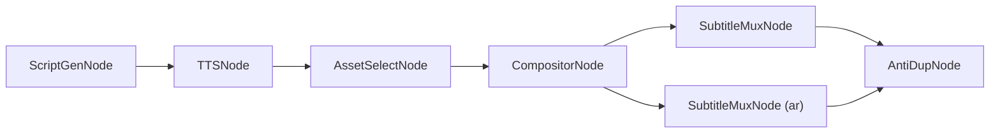

# 📐 DopaMatrix — PROJECT ROADMAP

> **多语言视频内容工厂 · Multilingual Video Content Factory**
>
> 本文档是 DopaMatrix 项目的**宪法级纲领**，所有后续开发均以此为准。
> 最后更新：2026-03-23

---

## 目录

1. [项目定位 (Mission)](#1-项目定位-mission)
2. [核心架构原则 (Core Architecture Principles)](#2-核心架构原则-core-architecture-principles)
3. [目录结构 (Project Layout)](#3-目录结构-project-layout)
4. [核心数据模型 (Key Data Models)](#4-核心数据模型-key-data-models)
5. [阶段实施规划 (Execution Phases)](#5-阶段实施规划-execution-phases)
6. [技术红线 (Hard Constraints)](#6-技术红线-hard-constraints)

---

## 1. 项目定位 (Mission)

> **"Marketing is no longer about the stuff that you make, but about the stories you tell and the emotions you trigger."**

DopaMatrix 绝不仅仅是一个传统的视频剪辑或混剪工具，而是**全球出海市场首个「基于情绪计算的互动叙事引擎 (Interactive Narrative & Affective Computing Engine)」**。

我们深刻认知到：无论是实体商家的洗地机，还是游戏公司的休闲小游戏，现代营销的本质都是**“兜售情绪”**。单向的视听轰炸已经失效，未来的高转化属于**“养成系互动错觉”**。通过捕获观众的互动反馈（如：评论区的“引战”与“神评”），我们赋予受众“造物主特权”，让下一次生成的视频画面和剧情由观众的意图来决定。

DopaMatrix 采用 **“单核双擎 (Single Core, Dual Engines)”** 战略，底层共享极致高并发的 FFmpeg 渲染基建，上层基于心理学框架（如八角行为分析法）重构 X/Y 轴，分为两大核心业务线：

| 业务线 | 定位与愿景 | 核心能力与情绪锚点 | 目标受众 |
|--------|----------|--------------|--------|
| **🎮 DopaMatrix UA**<br>(当前尖刀) | **通向 Playable Ads 的 AI 互动买量基建**。<br>将传统的单向广告投放，降维打击为**“与整个平台用户打一局真实的互动游戏”**。 | **众包式剧情生成 (评论篡改 DSL)** / 制造**焦虑、挫败、权力幻想**的 AIGC Hook 工厂 / 互动影游 (FMV) 极速打包管线 | 全球顶级游戏发行商 / 互动短剧出海团队 / 重度 UA 投放手 |
| **🏬 DopaMatrix Content** | **多语言情绪共鸣内容矩阵**。<br>挖掘实体商品的隐藏情绪价值，实现低门槛全球内容分发。 | 实体生活叙事 DSL 解析 / 制造**治愈、猎奇、FOMO(错失恐惧)** 的 Hook / Master-Variant 防封裂变 | 跨境 MCN / 实体出海门店 / SaaS 代理商 |

> [!IMPORTANT]
> **终极战略壁垒 — 神经营销流 (NeuroFlow)**
>
> DopaMatrix 绝不满足于“盲目生成”。我们将建立行业内首个**“情绪营销大模型”**。通过 API 回传全网投放的 ROI 数据，让系统自我学习“哪种商品特征+哪种情绪标签=最高转化率”，形成从“素材生成 → 情绪试错 → 归因回流 → 认知进化”的绝对商业闭环。除了预测流量趋势，NeuroFlow 更将执行**「情绪劫持与算法复苏」**：通过深度监听社交媒体的评论意图，自动反哺并重构底层的渲染坐标（X/Y 轴）。
>
> **对游戏买量 (UA) 的毁灭性打击：** 我们已打破“打广告”的传统定义。例如在 TikTok 投放策略游戏，系统可故意生成“选错兵种导致全军覆没”的视频以触发玩家嘲讽。当评论区出现“连弓箭手克制步兵都不懂”的嘲讽时，NeuroFlow 会自动抓取该评论，并极速生成下一个广告变体——开头直接挂出评论截图并回应：“这位网友说我蠢，那这次我全出弓箭手看看能不能赢！”这已然打破了第四面墙，将广告变成了与全平台用户连载互动的群体游戏，形成“素材投放 → 触发嘲讽 → AI 覆写 DSL → 众包剧情裂变”的无限流量闭环。

> DopaMatrix 致力于提供**纯粹的音视频渲染管线**。本系统**不包含**复杂的社交媒体抓取与自学习逻辑，而是通过标准化的 **Headless API** 向外暴露全部渲染能力，以便未来无缝接入上层的「**业务增长中枢系统 (GrowthOS)**」。

> DopaMatrix 致力于提供**纯粹的音视频渲染管线与动态 DSL 解析底座**。我们接收来自云端「GrowthOS」的高阶互动指令，完成高质量渲染，并返回带指纹与成本估算的结果报告。业务决策、数据学习、爆款分析等高阶逻辑，由 GrowthOS 负责。

> **商业模式跃迁 — 从纯 SaaS 到 SwaS (Software with a Service) 闭环**
>
> 传统的 SaaS 只给客户提供“铲子”，而 DopaMatrix 提供的是“金矿（结果）”。面对缺乏流量认知与精细化运营能力的实体商家和游戏发行商，平台全面拥抱 **SwaS (半平台+半代运营)** 模式。
>
> 为了支撑这一模式，我们的终端生态进行了极其严格的**物理与受众撕裂**：
> 1. **胖客户端 (Tauri 桌面端 - 内部重度生产)**：纯粹的“私有化印钞机”。面向内部代运营团队和大厂专业投手。追求极致的并发性能、硬核的防查重算法、跨平台多工作区无缝路由。不为小白妥协 UX，只为结果负责。
> 2. **瘦客户端 (TG Bot / H5 - 客户轻量消费)**：面向最终买单的普通客户。客户只需负责“投喂素材库”和“审批/接收意向线索”。通过“绿野仙踪”式的高级自动化汇报，用极低摩擦的交互建立起坚不可摧的商业信任。
>
> 我们不卖软件订阅，我们按线索 (CPL)、按视频交付量 (CaaS) 或按爆款提成 (Bounty) 收费。技术的极度复杂留给平台内部，体验的极度简单留给付费客户。

---

## 2. 核心架构原则 (Core Architecture Principles)

### 2.1 运行模式 — B/S Local First

```
┌─────────────────────────────────────────┐
│  Browser UI (Vue / React)               │  ← 未来可替换为云端前端
│  ↕  HTTP / WebSocket                    │
│  FastAPI Backend (本地进程)              │  ← 未来可直接部署为云 API
│  ↕                                      │
│  WorkflowEngine + FFmpeg (本地算力)      │  ← 核心渲染永远在本地
└─────────────────────────────────────────┘
```

- 所有核心视频渲染、节点流转在**本地**执行
- UI 层通过标准 HTTP / WebSocket 与后端通信
- 架构天然保留**云端化 / API 化**的迁移路径

#### 场景说明 (Use-Case Scenarios)

| 场景 | 终端 | 操作描述 |
|------|------|----------|
| **C 端 · 极速轻量** | 手机端 | 用户用手机拍摄库存或门店实录视频，上传后云端引擎自动融合 AI 素材，一键混剪出片，全程无需专业技能 |
| **B 端 · 深度矩阵** | 桌面端 | 运营人员在桌面端拉满本地电脑算力，进行深度的 X/Y 轴多维编排，并行启动多进程矩阵，极速批量裂变变体 |

### 2.2 工作流引擎 — DAG Workflow



- **抛弃线性脚本**，全部能力封装为 `BaseNode` 子类
- `WorkflowEngine` 负责 DAG 拓扑排序 → 依次/并行调度节点
- 数据通过 `WorkflowContext` 这条统一数据总线在节点间流转

### 2.3 多语言母带模式 — Master-Variant

```
Master Video (无字幕纯净画面)
  ├── + zh.ass  →  中文变体 .mp4
  ├── + ar.ass  →  阿拉伯语变体 .mp4 (RTL)
  ├── + en.ass  →  英语变体 .mp4
  └── + ...     →  任意语言变体
```

> [!CAUTION]
> **绝对禁止**将字幕硬编码烧录进视频像素。必须通过 `-c:s copy` 或流式 mux 方式挂载 `.ass` 软字幕/外挂字幕。

### 2.4 多维混剪与槽位渲染 — X/Y Axis & Slot-based Rendering

这是 DopaMatrix 的**核心竞争壁垒**。

#### Timeline 数据结构（二维模型）

| 轴 | 含义 | 示例 |
|----|------|------|
| **X 轴 (Time)** | 时间线推进 — 片段顺序拼接 | Clip A → Clip B → Clip C |
| **Y 轴 (Layer)** | 空间图层叠加 — 从底到顶 | Layer 0: 底层视频 / Layer 1: 特效 / Layer 2: 贴纸 |

```
Y (Layer)
│  ┌──────┐          ┌────┐
│2 │Sticker│          │Logo│        ← 顶层贴纸/水印
│  └──────┘          └────┘
│  ┌───────────────────────────┐
│1 │    Overlay / VFX           │    ← 中层特效
│  └───────────────────────────┘
│  ┌──────────┐┌──────┐┌──────┐
│0 │  Clip A   ││Clip B ││Clip C│    ← 底层视频素材
│  └──────────┘└──────┘└──────┘
└─────────────────────────────────→ X (Time)
```

#### FFmpeg 槽位 (Slot) 渲染模式

```bash
# 概念示例 — Timeline → FFmpeg Complex Filtergraph
ffmpeg \
  -i clip_a.mp4      \   # [0:v] → slot v0
  -i clip_b.mp4      \   # [1:v] → slot v1
  -i overlay.png      \   # [2:v] → slot v2
  -filter_complex "
    [0:v][1:v] concat=n=2:v=1:a=0 [base];
    [base][2:v] overlay=x=10:y=10:enable='between(t,2,5)' [out]
  " \
  -map "[out]" master.mp4
```

> [!IMPORTANT]
> **CompositorNode 的职责**：将 `Timeline` 对象**编译**为带 `[v0]`, `[v1]` 等动态输入槽位的 FFmpeg 命令流，而非逐帧操作。

> [!CAUTION]
> **严禁引入 `moviepy` 等逐帧处理库。** 所有视频合成必须通过 FFmpeg 原生命令完成。

---

## 3. 目录结构 (Project Layout)

```
DopaMatrix/
├── PROJECT_ROADMAP.md          ← 本文档（宪法）
├── requirements.txt
├── main.py                     ← 入口 / FastAPI 启动
│
├── src/
│   ├── core/                   ← 引擎核心
│   │   ├── __init__.py
│   │   ├── context.py          ← WorkflowContext (已完成 ✔)
│   │   ├── base_node.py        ← BaseNode 抽象基类 (已完成 ✔)
│   │   ├── engine.py           ← WorkflowEngine (DAG 调度)
│   │   └── timeline.py         ← Timeline 二维数据结构
│   │
│   ├── nodes/                  ← 业务节点（FFmpeg 编译与执行逻辑高内聚于此层）
│   │   ├── __init__.py
│   │   ├── script_gen.py       ← LLM 文案生成
│   │   ├── tts_node.py         ← TTS 语音合成
│   │   ├── asset_select.py     ← 素材检索/匹配（SQLite LRU + Hook 隔离）
│   │   ├── assembler.py        ← AssemblyNode：X 轴素材拼接 + Y 轴叠加轨道构建 → Timeline
│   │   ├── compositor.py       ← FFmpegCompositorNode：Timeline → Complex Filtergraph 编译
│   │   │                          内含槽位分配、滤镜链构建、子进程执行与进度解析 [核心渲染]
│   │   ├── subtitle.py         ← .ass 字幕挂载 (Master → Variant)
│   │   └── anti_dup_node.py    ← 去重 / 混淆
│   │
│   │   # ⚠️ src/ffmpeg/ 独立封装层已移除：实战证明将槽位分配、Filtergraph 编译、
│   │   #    子进程执行等逻辑直接内聚于 FFmpegCompositorNode 内部，可读性与维护性更佳。
│   │
│   ├── localization/           ← 多语言 & RTL
│   │   ├── __init__.py
│   │   └── ass_generator.py    ← .ass 字幕生成（含 RTL 排版）
│   │   # ⚠️ rtl_utils.py 已移除：实战证明 FFmpeg 原生 HarfBuzz 已完美支持 RTL 连写，采用极简透传方案
│   │
│   ├── api/                    ← FastAPI 接口层
│   │   ├── __init__.py
│   │   ├── routes.py           ← REST 端点
│   │   └── schemas.py          ← Pydantic 数据校验
│   │
│   └── utils/                  ← 通用工具
│       ├── __init__.py
│       ├── file_utils.py
│       └── config.py
│
├── tests/                      ← 测试
│   ├── test_engine.py
│   ├── test_timeline.py
│   ├── test_compositor.py
│   └── test_subtitle_mux.py
│
├── assets/                     ← 测试素材 (不入 Git)
│   ├── clips/
│   ├── overlays/
│   └── subtitles/
│
└── web/                        ← 前端 (Phase 5)
    ├── index.html
    └── ...
```

---

## 4. 核心数据模型 (Key Data Models)

### 4.1 WorkflowContext（已实现 ✔）

```python
class WorkflowContext:
    session_id: str
    config: Dict[str, Any]      # 全局配置
    assets: Dict[str, Any]      # 核心资产路径
    variants: Dict[str, Dict]   # 多语言变体 {"ar": {"subtitle_ass": "...", "final_video": "..."}}
```

### 4.2 Timeline（Phase 2 实现）

```python
@dataclass
class ClipItem:
    source: str          # 素材文件路径
    start: float         # 素材内截取起点 (秒)
    duration: float      # 持续时长 (秒)
    layer: int = 0       # 所在图层 (Y 轴)
    position: float = 0  # 在时间线上的放置位置 (X 轴，秒)
    effects: List[str] = field(default_factory=list)  # 应用的滤镜

@dataclass
class Track:
    layer: int                     # 图层编号 (0=底层)
    track_type: str                # "video" | "audio" | "overlay"
    clips: List[ClipItem] = field(default_factory=list)

@dataclass
class Timeline:
    tracks: List[Track] = field(default_factory=list)
    width: int = 1920
    height: int = 1080
    fps: float = 30.0

    def compile_to_ffmpeg(self) -> str:
        """将二维 Timeline 编译为 FFmpeg 复杂滤镜图命令"""
        ...
```

### 4.3 DAG Workflow 定义格式（Phase 1 实现）

```python
# 以 Python dict 定义，未来可序列化为 JSON/YAML
workflow_def = {
    "nodes": {
        "script":    {"type": "ScriptGenNode",   "params": {...}},
        "tts":       {"type": "TTSNode",         "params": {...}},
        "asset":     {"type": "AssetSelectNode", "params": {...}},
        "composite": {"type": "CompositorNode",  "params": {...}},
        "subtitle":  {"type": "SubtitleMuxNode", "params": {...}},
    },
    "edges": [
        ("script", "tts"),
        ("tts", "asset"),
        ("asset", "composite"),
        ("composite", "subtitle"),
    ]
}
```

---

## 5. 阶段实施规划 (Execution Phases)

---

### Phase 1 — 引擎基石与基础节点 (Engine & Basic Nodes)

**目标**：搭建 DAG 工作流引擎骨架，打通简单数据流转闭环。

- [x] 定义 `WorkflowContext` 数据总线 (`src/core/context.py`)
- [x] 定义 `BaseNode` 抽象基类 (`src/core/base_node.py`)
- [x] 实现 `WorkflowEngine` — DAG 拓扑排序与调度 (`src/core/engine.py`)
  - [x] 节点注册 & 边定义
  - [x] 拓扑排序 (Kahn's Algorithm)
  - [x] 顺序执行 & 错误处理
  - [x] 并行执行支持（无依赖节点并发调度）
- [x] 开发 `EchoNode` / `PassthroughNode` 用于单元测试验证引擎闭环
- [x] 编写 `tests/test_engine.py`，覆盖：线性流、分叉流、环检测
- [x] 补充 `WorkflowContext` 的节点级输出存储能力 (`node_outputs`)

---

### Phase 2 — 核心渲染引擎打造 (Timeline & FFmpeg Slot Engine)

**目标**：实现基于 X/Y 轴的二维混剪引擎，完成 Timeline → FFmpeg 编译。

- [x] 设计 & 实现 `Timeline` / `Track` / `ClipItem` 数据结构 (`src/core/timeline.py`)
- [x] 实现 `AssemblyNode` (`src/nodes/assembler.py`) — Timeline 拼装节点
  - [x] 从 `context.assets["scene_clips"]` 读取按场景排列的素材，X 轴顺序拼接
  - [x] 支持 Y 轴叠加轨道（Logo / Sticker），层号与 `enable` 时间区间动态计算
  - [x] Fallback：若无 `scene_clips` 则退回背景视频循环铺满总时长
  - [x] 写入 `context.assets["timeline"]` 供 `FFmpegCompositorNode` 消费
- [x] 实现 `FFmpegCompositorNode` (`src/nodes/compositor.py`) — 高内聚渲染核心
  - [x] 输入槽位分配 & 命名（`[v0]`, `[v1]`, ...），内联于节点内部（无独立 `src/ffmpeg/` 层）
  - [x] Complex Filtergraph 编译：`concat`（X 轴）+ `overlay`（Y 轴，含 `enable` 时间区间）+ `amix`（音频混合）
  - [x] 子进程执行 + 实时进度解析（`-progress pipe:1`），内联于节点内部
  - [x] 动态分辨率解析（`9:16` / `16:9` / `1:1`），输出 master 视频路径至 `WorkflowContext`
- [x] 编写 `tests/test_timeline.py` — 数据结构序列化 / 反序列化
- [x] 编写 `tests/test_compositor.py` — 用测试素材验证实际渲染输出

---

### Phase 3 — 内容生成、混合素材调度与多语言适配 (Content, Hybrid Asset Scheduling & Localization) ✅

**目标**：接入 LLM / TTS，实现混合素材动态调度引擎，攻克阿拉伯语 RTL 在 `.ass` 字幕中的排版。

- [x] 实现 `ScriptGenNode` — LLM 文案生成 (`src/nodes/script_gen_node.py`)
- [x] 实现 `TTSNode` — 语音合成 (`src/nodes/tts_node.py`)
- [x] 实现 `AssetSelectNode` — **智能弹药库与 Hook 隔离策略** (`src/nodes/asset_select_node.py`)
  > [!IMPORTANT]
  > **核心商业逻辑升级**：废弃单纯的本地文件夹扫描，改为直接读取本地 SQLite 数据库 (`local_assets_inventory`)。
  > 1. **Hook 隔离**：强制首个镜头抽取 `video_role='hook'` 的黄金片头。
  > 2. **LRU 防疲劳**：采用“最少使用优先”算法抽取混剪骨料 (`body`)，用完后 `usage_count` 自动 +1。
- [x] “废弃 1变3 渲染，强制首发单一语言（如英语），验证 CTR 后再调取母带秒级挂载其他语言（如阿语）”，这是节省算力的核心红线。 
- [x] 实现多语言字幕系统 (`src/localization/`)
  - [x] `ass_generator.py` — 从文案 + 时间戳生成 `.ass`
  - [x] FFmpeg 原生 HarfBuzz 完美支持 RTL，极简透传。
- [x] 实现 `SubtitleMuxNode` (`src/nodes/subtitle_mux_node.py`)
  - [x] Master + .ass → Variant 流式输出 (Test-First 单语种优先渲染)
- [ ] **Prompt 模板化解耦 (Template Decoupling)**：彻底废弃 Python 代码中硬编码的 System Prompt。引入 Jinja2 模板引擎，将 Prompt 抽取为独立的 `.jinja` 文本资产。通过代码动态注入变量（如 `target_languages` 数组），实现无限多语种配置的平滑扩展，无需修改底层业务逻辑代码。  

---

### Phase 4 — 高并发矩阵裂变与防封管线 (High-Concurrency Matrix & Anti-Dup) ✅

**目标**：抛弃单线程线性出片，引入 `ProcessPoolExecutor` 多进程池，彻底压榨本地 CPU 多核算力；结合底层防查重参数，实现批量变体的极速裂变。

- [x] 实现 `MatrixEngine` — 多进程任务调度器 (`src/core/matrix_engine.py`)
- [x] 实现批量任务提交接口 — 纯异步非阻塞 (返回 HTTP 202)
- [x] 实现 `AntiDupNode` (`src/nodes/anti_dup_node.py`)
  - [x] 视觉扰动：微调亮度/对比度/色相
  - [x] 时间扰动：首尾微量裁剪 / 随机变速

---

### Phase 5 — FastAPI 接口层与数据基建 (Headless API & Data Infrastructure) ✅

**目标**：构建标准化的 Headless API 接口层，引入轻量级数据库实现任务流与资产指纹的持久化管理。

#### 5.1 数据库基建 (SQLite / SQLAlchemy) ✅
- [x] 设计并实现 ORM 数据模型 (`src/db/models.py`)
  - [x] `VideoTask` — 任务流记录。
  - [x] `LocalAsset` (`local_assets_inventory`) — 本地 DAM 资产大盘，包含 `file_hash`, `usage_count`, `video_role`, `is_exhausted` 等疲劳度管理字段。

#### 5.2 FastAPI 接口层 (`src/api/`) ✅
- [x] `POST /tasks/submit` — 异步提交渲染任务，立即返回 202。
- [x] `POST /assets/import` — 物理 MD5 防重导入素材。
- [x] `GET /assets/list` — 资产指纹库浏览与状态下发。
- [x] **Webhook 异步回调**：任务完成后向 `WEBHOOK_URL` 推送包含最终视频路径与 Hash 的结案报告。

#### 5.3 硬件加速与性能基建 (Hardware Acceleration & Performance) 🚀 [Next]
- [ ] **GPU 硬件加速自适应 (Auto-Fallback)**：渲染引擎动态检测系统是否具备兼容的独立显卡（如 Nvidia GPU）。若有，自动将视频编码器从 `-c:v libx264` 切换为 `-c:v h264_nvenc`榨干硬件算力；若无，静默降级为 CPU 稳态渲染，实现 100% 客户机兼容。
- [ ] **数据库并发锁消除**：通过在 SQLAlchemy 引擎层开启 SQLite 的 WAL (Write-Ahead Logging) 模式，实现读写分离，彻底解决 UI 高频轮询带来的 `database is locked`性能瓶颈。

---

### Phase 6 — V1.5 云端中枢与 Agent 协同编排 (GrowthOS & Agent Orchestration)

**目标**：打破本地信息孤岛，引入 WebSocket 长连接与开源多智能体框架，实现从“单机渲染工具”到“云端控制节点”的跨越，建立视频基因溯源体系。(请在项目中新建一个文件夹 `src/api/agent_tools/`，并在里面新建一个文件 `schemas.json`。这就是你们未来“中枢大脑”控制“底层印钞机”的遥控器说明书。)

#### 6.1 WebSocket 长连接与双向策略下发 (The Nervous System)
- [ ] **建立持久化通道**：在 FastAPI 引入 WebSocket，使本地 DopaMatrix 保持对云端 GrowthOS 的长连接监听。
- [ ] **本地实时进度推送 (无中间件架构)**：坚决摒弃 Redis 等重型中间件，捍卫桌面端“单体免安装”的极致体验。通过 Python 内存事件总线 (Event Bus) 捕获 FFmpeg 子进程进度，并经由 WebSocket 管道像心跳一样平滑推送给前端 UI。
- [ ] **Copilot 模式 (半托管)**：云端下发策略卡片（如：“检测到近期中东市场 #Tire 标签爆火，是否应用该策略生成 10 个视频？”），UI 弹出确认框，用户一键执行。
- [ ] **Autopilot 模式 (全托管)**：云端直接下发 JSON 渲染指令，本地引擎在后台静默排队、静默渲染、自动回传，彻底实现“无人值守印钞”。

#### 6.2 多智能体框架集成 (DeerFlow & CrewAI Integration)
> **设计原则**：DopaMatrix 保持纯粹的渲染工具属性（Tool），由外部 Agent 框架负责实时感知与预测推理。
- [ ] **DopaMatrix Tool 封装**：将 `POST /tasks/submit` 封装为标准的 LangChain/CrewAI 可调用工具 (`DopaMatrix_Render_Tool`)。
- [ ] **轻量级编排 (CrewAI)**：构建创意工作组（数据分析师 Agent -> 文案编剧 Agent -> 执行导演 Agent -> 调用 DopaMatrix 出片）。
- [ ] **深度数据挖掘 (DeerFlow)**：利用字节 DeerFlow 的强大沙盒与爬虫能力，自动抓取 TikTok/Meta 的行业竞品爆款数据，喂给 CrewAI 进行二次创作。
- [ ] **全天候流量雷达 (DeerFlow 2.0)**：升级接入 DeerFlow 2.0。利用其强大的沙盒环境与高频数据流处理能力，实时监听 TikTok/Meta 的大盘异动，重点捕捉处于“潜伏期”高增长率的音轨与视觉模因 (Memes)。
- [ ] **动态技能路由 (Dynamic Skills Routing)**：打造“对话即服务”体验。隐藏复杂的节点连线，Agent 根据运营人员自然语言意图，动态加载 `Trend_Forecasting_Skill`,`DataRetrieval_Skill`, `Localization_Skill` 等独立技能模块，整理参数后统一抛给底层固定 Workflow 执行。

#### 6.3 视频基因溯源机制 (Gene Traceability)
- [ ] **指纹埋点**：在 Webhook 回调的结案报告中，强绑定 `hook_asset_hash`, `bg_assets_hash`, `script_id` 和 `tts_voice`。
- [ ] **血统追踪**：让云端 GrowthOS 清晰知道每一个导出的变体视频，是由哪几个具体的“骨相（画面）”和“皮相（文案）”拼装而成的，为未来的 ROI 归因提供绝对精准的数据源。

#### 6.4 混合视觉生成管线 (AIGC Generative Hooks)
> **设计原则**：用 AI 做“矛”(引流)，用实拍做“盾”(转化)，解决传统商家素材枯竭痛点。
- [ ] **生成类节点引入**：在 DAG 中新增 `GenerativeHookNode`，对接 Kling / Runway / Midjourney API。
- [ ] **视觉张力重构**：允许用户上传枯燥的传统商品实拍，系统自动调用图生视频 API，生成前 3 秒极具“空间错位感”或“荒诞感”的 Hook（如：长城上贴瓷砖），再与真实素材无缝拼接。
- [ ] **低门槛 PPT 魔法流**：沉淀基于 FFmpeg 滤镜（抠图 Overlay + Zoom 极速缩放）的固定“时空穿越模板”，单图即可裂变鬼畜吸睛短视频。

#### 6.5 自动化 Hook 工厂 (The Hook Engine)
> **设计原则**：买量引擎的核心是“心理触发实验”，前 3 秒决定 80% 转化，需建立独立的高能片头流水线。
- [ ] **Hook 骨架库**：内置挑战型（Competence）、反差型（Transformation）、挫败型（Frustration）、猎奇型（Curiosity）等心理触发 DSL 模板。
- [ ] **全自动缝合线**：系统自动调用 AIGC 视觉张力素材 + TTS 猎奇配音 + 大字报夸张字幕，日均静默生成上百个独立 Hook 切片，注入本地 SQLite 素材大盘。
- [ ] **A/B 测试变量池**：为同一个实拍 Body（盾），自动排列组合 50 种不同的 Hook（矛），生成用于跑量测试的矩阵变体。

#### 6.6 Story DSL 解析与双引擎智能调度 (Story DSL & Dual Engines) 🧠
> **设计原则**：彻底摒弃基于物理图层的“盲拼”，升级为基于语义标签和逻辑节拍的“智能调度”。
- [ ] **Story DSL 解析器引入**：开发 `DSLParserNode`，能够读取基于意图的视频脚本语言（如 `HOOK: shot_type=customer_reaction`）。
- [ ] **Content Engine (实体商家/叙事引擎)**：内置生活叙事结构 DSL（X轴：Hook → Context → Build → Reveal → CTA）。侧重于故事的连贯性、情感的层层递进与品牌逻辑的植入。
- [ ] **UA Engine (游戏买量情绪引擎)**：内置心理触发结构 DSL（X轴：Problem → Failure → Near Win → Reward）。侧重于制造挫败感、优越感与行动冲动。**注：本阶段优先服务于 15s 导流视频的极致情绪调用。**
- [ ] **语义调度路由**：系统根据用户身份（短剧发行商 vs 游戏投放手），下发不同的 Story DSL。引擎自动根据标签（如 `emotion: frustration`）从资产库中抽取素材，交由 FFmpeg 渲染。

#### 6.7 V2V 视觉重绘与跨国本地化管线 (V2V & Global Localization) 🌍
> **设计原则**：打破传统实拍素材的文化壁垒与衰退周期，利用 AIGC 视觉重绘技术实现动作 1:1 复刻与画风/人种的无缝替换，将单一优质爆款的生命周期无限延长。
- [ ] **跨国本地化降维打击 (Cross-border Actor Swap)**：在云端中枢集成 V2V (Video-to-Video) 与 ControlNet 能力。将本土实拍爆款素材（如亚洲演员）的面孔、肤色、着装，1:1 重绘为目标市场（如欧美、中东）的本土化视觉特征，彻底消除出海买量的文化摩擦力。
- [ ] **优质底模库策略 (Curated Master-Templates)**：坚决摒弃“允许用户随意上传视频进行 AI 重绘”的高风险黑盒模式（极易引发手指变异、背景闪烁等 AI 幻觉）。平台预先人工验证并内置一批动作干净、背景清晰的“官方优质底模 (High-Yield Masters)”。用户仅需基于底模选择目标画风，保障 99% 的商用出片良品率。
- [ ] **素材暴力续命 (Combating Ad Fatigue)**：当爆款实拍素材进入流量衰退期时，自动调用 V2V 接口进行“画风突变”（如实拍转 3D 动漫、赛博朋克风），生成物理 Hash 与视觉感知均全新的原创视频，零拍摄成本榨干素材的剩余流量价值。

#### 6.8 统一事件总线与动态消息路由 (Unified Event Bus & Routing) 🔔
> **设计原则**：彻底解决“通知疲劳”。建立严格的消息分级机制，将状态安抚、系统告警、商业提案与外部客诉物理隔离。实现基于用户在线状态的智能路由，在 Tauri (胖) 与 TG Bot (瘦) 之间无缝切换触达通道。
- [ ] **行动驱动型通知中心 (Actionable Notification Center)**：在 Tauri 端重构 🔔 通知中心。所有系统告警（如：素材耗尽、Token 不足）必须携带对应的“Deep Link 修复按钮”（如：跳转至充值页、跳转至素材上传页），实现闭环操作。
- [ ] **AI 决策提案卡片 (NeuroFlow Proposal Cards)**：改变传统的被动触发模式。云端大脑结合营销日历，主动向大盘推送交互式卡片（如：“万圣节将至，建议生成 50 条变体”）。提供 `[一键批准]` 与 `[修改]` 按钮，将系统转变为“自动驾驶”模式。
- [ ] **离线唤醒与防打扰路由 (Away-State Ping)**：建立多端在线状态监测（Presence Check）。仅当运营人员离开电脑端时，长耗时任务的完成报告才会被路由至 TG Bot 进行移动端唤醒，保障沉浸式工作体验。

---

### Phase 7 — 客户端生态与 PMF 内测版 (Client Ecosystem MVP v1.0) 🚀

**目标**：在不污染底层纯净引擎的前提下，构建面向 B端/C端 客户的交互外壳，完成商业化验证。

#### 7.1 B端重度客户：桌面端矩阵工作站 (Tauri + Vue 3) [状态：v1.0 MVP 封板中]
> **定位**：部署在客户本地电脑，基于“意图驱动”的私有化印钞机。
- [x] **架构升级**：实现“首屏 ROI 看板” + “沉浸式 AI Feed 工作台”的双视图平滑切换。
- [ ] **UI 范式颠覆 (Block Matrix)**：抛弃传统的树状文件管理。引入“看板式积木块”，X轴（叙事节拍）为看板列，Y轴（情绪标签）为筛选器，拖拽标签即可生成 Story DSL 可视化链条。
- [x] **数字资产管理 (DAM)**：独立的素材库面板，可视化展示 X轴/Y轴素材的“疲劳度血条”与“引用次数”，支持设置 Hook 身份。
- [x] **异步无阻塞体验**：前端任务 Feed 流 + 轮询/Webhook 状态更新，告别干等。
- [ ] **动态耗时预估 (Dynamic Time Estimation)**：基于当前物理机的 CPU 核心数与引擎自学习的渲染消耗系数 ($k$)，在任务提交前提供精准的“预计耗时”测算，用可控的进度预期消除矩阵渲染等待期的用户焦虑。
- [x] 打包分发：采用 Tauri Sidecar (边车模式) 构建单体 `.exe`安装包，实现 Python 核心引擎的无感自启。

#### 7.2 C端轻量客户：移动端极速投喂 (Telegram Bot) [状态：新开战线]
> **定位**：面向汽修店老板/买量投放手，移动办公的“极速触角”与 PLG 转化漏斗。
- [ ] **Zero-UI 交互理念 (Conversational Asset Management)**：用户只需在对话框发送视频和语音（如“修了个底盘，很解压”），后台 VLM 自动打上隐藏的 Y 轴标签 (`shot_type: repair`, `emotion: satisfying`)，彻底免除手动建文件夹的门槛。
- [ ] **独立微服务**：Node.js + Telegraf/Discord.js 架构。
- [ ] **业务闭环**：极速上传素材 -> 发送自然语言渲染指令 -> 调用桌面端 API -> 接收 Webhook 获取成品 -> Bot 内原生转发分享。
- [ ] **C 转 B 商业化漏斗**：设置免费产出配额墙，引导高频客户升级“企业版专属桌面主机”（TG Bot 的定位是“诱饵”。加入“每日配额墙”和“Magic Link 扫码引流桌面端”的转化机制）。

#### 7.3 桌面端遥测与激活基建 (Telemetry & Engagement) 📡
> **设计原则**：把控软件的生命线。将物理隔离的桌面端节点，变为受云端中枢 24 小时监控并可主动施加运营干预的在线终端。
- **登录即留痕 (UPSERT Traceability)**：打通跨端 Magic Link 或第三方扫码后，每一次终端登录授权必须在云端触发 `last_login` 与设备特征记录，彻底消除“僵尸账号”。
- **价值事件探针 (Value Event Probe)**：用户的每一次矩阵下发、算力消耗，均通过底层的 Webhook 或埋点精准上报。为未来的商业化计费与高净值用户筛选提供绝对的数据支撑。
- **多巴胺促活机制 (Dopamine Triggers)**：通过云端下发的“配额重置”、“限时爆款库更新”等弹窗机制，人为制造“错失恐惧 (FOMO)”，拉升日活粘性。
- **版本强制汰换 (Deprecation Barrier)**：引入硬核的云端版本拦截机制。对存在严重缺陷的老旧安装包，云端可一键下发“熔断指令”，强制用户更新，降低跨国技术支持与排障成本。

---

### Phase 8 — V2.0 视觉引擎与全自动闭环 (AI Vision & Full Autopilot)

**目标**：引入多模态视觉能力（VLM），让系统真正“看懂”本地素材库；打通公域播放量数据，实现以 ROI 为导向的自动优胜劣汰与无限爆款裂变。

#### 8.1 视觉引擎与素材自动打标 (Auto-Tagging & VLM)
- [ ] **AI 视觉审片**：用户批量导入 100 个车间视频时，系统自动截取关键帧，调用多模态大模型（如 GPT-4o / Gemini 1.5 Pro Vision）。
- [ ] **语义 Y 轴自动补全 (Semantic Auto-Tagging)**：彻底废弃人工建文件夹。调用多模态大模型扫描入库视频，自动按全新 Y 轴规范写入 SQLite：提取镜头类型 (`shot_type: closeup / env`)、情绪属性 (`emotion: satisfying / frustration`) 与场景实体，为 Story DSL 提供极其精准的弹药库。
- [ ] **智能 Hook 判定**：基于视觉张力算法，AI 自动从长视频中截取出前 3 秒最吸引眼球的片段，并自动在数据库中标记为 `video_role='hook'`。

#### 8.2 基因可视化大屏 (Gene Visualization)
- [ ] **Hook 热力图**：在桌面端/云端 UI 呈现素材库的热力看板，哪些 Hook 组合带来的曝光量最高，以“基因树”的形式可视化展示。
- [ ] **素材疲劳度熔断机制**：当某个素材在全网播放量超过阈值（如被标记为烂大街），系统 UI 自动将其标红并进入“冷冻期”，防止账号被平台判罚重复搬运。

#### 8.3 商业数据闭环与全自动放量 (The Holy Grail & Amplification) 🔄
- [ ] **生态回流 API**：接入 Meta Ads / TikTok 开发者 API，将变体视频的真实消耗、完播率、转化率 (CPA/ROAS) 实时拉取回云端 GrowthOS。
- [ ] **达尔文进化算法 (Darwinian Attribution)**：GrowthOS 自动分析高 ROI 视频的基因溯源数据（血统追踪）。精准定位出究竟是哪个 Hook 组合（如：东南亚市场 + 红色贴纸 + 前3秒爆音）跑赢了大盘。
- [ ] **爆款 DNA 固化与自动放量 (DSL Solidification & Amplification)**：一旦锁定高转化基因，系统**绝不依赖人工复刻**。直接将该规律固化为结构化的 `Story DSL` 模板（Prompt），自动下发给底层的 DopaMatrix 引擎，瞬间“放量”裂变 100 个同基因、不同素材的变体，彻底榨干该爆款逻辑的流量红利。

#### 8.4 智能切片与语义剪辑管线 (Smart Clipping & Semantic Editing) ✂️
> **设计原则**：针对短剧、漫剧、有声小说等长视频买量客户，彻底淘汰人工“三倍速看片找高潮”的血汗模式。通过“端侧极低成本抽帧 + 云端大模型语义解构”的端云协同架构，实现长视频的全自动切片与高光提炼。
- [ ] **端侧素材粉碎机 (Local Asset Shredder)**：在桌面端引入预处理机制。利用本地 FFmpeg 极速分离长视频的低频音频流（16kHz），并以极低帧率（如 1 FPS）抽取视频缩略图矩阵，将几十 GB 的原片压缩为几 MB 的特征数据，彻底打破上传带宽瓶颈。
- [ ] **云端语义审片员 (Cloud Semantic Analyst)**：在 GrowthOS 部署多模态分析 API。结合 ASR（语音识别，如 Whisper）与 VLM（视觉大模型，如 Gemini 1.5 Pro Vision）。让大模型阅读缩略图和台词，自动识别剧本中的冲突点、情绪高潮（如：扇耳光、下跪、决裂），并返回带有精准时间戳（Timestamp）的 JSON 切片菜谱。
- [ ] **VAD 智能去水 (Voice Activity Detection)**：利用本地轻量级 VAD 算法，自动扫描长剧音频，精准剔除无对白的无效留白片段，确保生成的推广素材全程高能。
- [ ] **精准下刀与重组 (Precision Trimming & Reassembly)**：升级底层 Story DSL，支持 `trim_start` 与 `trim_end` 指令。引擎根据云端返回的时间戳，对本地高清原片进行精准切割，并自动缝合高能 Hook、转场与互动按钮（Playable UI），实现“长剧入，百条买量短片出”的全自动流水线。

#### 8.5 多模态融合与冲突仲裁中枢 (Multimodal Fusion & Arbitration) ⚖️
> **设计原则**：解决本地引擎在并发处理长视频时，视觉模型 (YOLO) 与听觉模型 (SenseVoice) 产生的情绪判定冲突（如：画面微笑，声音愤怒）。绝不抛弃高冲突素材，而是将其转化为提升完播率的究极武器。
- [ ] **领域霸权路由 (Domain Dominance)**：系统根据内容类型动态切换主导权。漫剧/互动影游强制执行“音频霸权主义 (Audio-Driven)”；休闲游戏 UA 强制执行“视觉霸权主义 (Vision-Driven)”。
- [ ] **交叉验证与置信度对决 (Confidence Thresholding)**：系统自动比对视觉与音频的置信度 (Confidence Score)，过滤低维噪音，动态采纳高维置信结论。
- [ ] **反差高光提权 (The "Conflict is Hook" Strategy)**：当视听双模态发生极端冲突且双高置信时，系统不进行抹杀，而是生成稀有标签 `[emotion: extreme_contrast]`，强制提权为 S 级片头 Hook。
- [ ] **云端大脑兜底 (Cloud Escalation)**：对于本地小模型无法解析的复杂语境（如：阴阳怪气的反语），引擎将特征切片极速打包上报，由云端 NeuroFlow 大模型进行上下文终极仲裁。

---

### Phase 9 — V3.0 互动买量与 Playable 引擎 (The Interactive Frontier) 🚀

**目标**：打破纯视频买量的天花板，解决“货不对板”痛点，实现从“观看”到“试玩”的端到端自动化生成，切入千亿级休闲小游戏分发市场。
> **战略聚焦**：暂缓 H5 游戏底层工程开发，全力攻克互动短剧/影游的“5MB 体积红线”与多分支视频打包难题。

#### 9.1 ACG 叙事解析与互动影游打包器 (ACG Narrative & Interactive FMV) 🎭
> **设计原则**：针对漫剧、有声小说、互动影游的“三位一体”趋势，建立独立于休闲游戏的“上下文叙事解析器”。通过制造剧情悬念与“故意破绽”，最大化激发观众的优越感与评论欲。
- [ ] **分支逻辑 DSL 支持**：引擎支持解析多分支剧情模板（如：`Video A -> [选项1: 播 B] / [选项2: 播 C]`）。
- [ ] **多轨决策树解析 (Dialogue Tree Parsing)**：联合 ASR (语音识别) 与 NeuroFlow 大模型，深入理解长视频的上下文逻辑。自动定位互动影游中的“关键抉择点”与“高血压/脑残分支”。
- [ ] **破绽截断与悬念制造 (Cliffhanger & Flaw Mechanic)**：改变传统的完整剧情剪辑法。引擎自动在“华丽铺垫”后拼接“脑残选择”，并在最惨烈后果发生的前 0.5 秒强制截断画面。
- [ ] **互动情绪 CTA 挂载**：在截断处，通过底层的 Y 轴动态挂载互动 UI 贴纸（如：双选按钮、嘲讽大字报），配合 TTS 语音引导站队，将单向视频转化为强互动的 Playable 雏形。
- [ ] **H5 互动影游一键打包 (`InteractiveExportNode`)**：将带有不同选项分支的视频片段及控制逻辑 (`state.json`)，一键打包为轻量级 `.zip` 格式的 HTML5 可试玩广告包，实现“所见即所玩”，可直接作为可试玩广告 (Playable Ad) 投放。
- [ ] **视频流极限融合 (The Timeline Jump Hack)**：利用 FFmpeg 将 [开头] + [分支 A] + [分支 B] 缝合为单一视频流。通过前端 JS 精准控制 `currentTime` 实现分支跳跃，规避网盟对多视频文件的封杀。
- [ ] **Base64 / 雪碧图走私 (MRAID Smuggling)**：针对严苛网盟，自动将视频降维或转为 Base64 字符串嵌入单文件 HTML，确保 3 个分支的互动视频总包 < 5MB。
- [ ] **端侧音频情绪引擎 (Local Audio Understanding)**：针对有声小说和漫剧动辄数小时的长音频，废弃高成本的云端 ASR 上传。在 Tauri 桌面端通过 ONNX 运行时集成量化版 `SenseVoice-Small` 模型。利用客户本地 CPU/GPU 算力，离线完成长音频的台词转录、BGM/掌声事件检测与细粒度情绪打标，输出高精度时间戳以驱动后续的动态配图。

#### 9.2 游戏买量 (UA) 情绪导流管线 (Emotional Guiding Pipeline) 🎮
> **设计原则**：对于休闲游戏投放，平台不负责生成 H5 小游戏本体，而是专注于生成极致吸睛的 15 秒“引流视频 + CTA”。流量直接导向客户已有的 Playable 链接。
- [ ] **伪实机与参数化引擎 (Fake-Gameplay Compositing)**
：客户上传游戏背景与透明骨骼动画 (Sprite WebM)，FFmpeg 通过阵型复制逻辑，零成本秒级合成“伪实机战斗场面”。
- [ ] **情绪破绽截断 (The Deliberate Flaw)**：系统强制采用 `[高光铺垫] -> [脑残选择] -> [悬念截断]`
 结构。在全军覆没的前 0.5 秒截断视频，挂载 CTA 按钮：“点击立即亲自指挥”，将情绪转化为极致的点击率 (CTR)。

#### 9.3 参数化互动短剧管线 (Parametric Interactive Drama Pipeline) 🎬
> **设计原则**：彻底抛弃高成本、高不可控性的实时大模型视频生成（如 Sora/SVD）。采用“预制高清底模 + 动态资产物理注入”的工程降维打击，实现极低算力成本下的商用级 Vlog 与互动连载短剧。
- [ ] **场景空镜头底模基建 (Empty Scene Masters)**：系统支持导入高质量的人工/AI预制视频切片（包含特定动作、情绪，预留商品/IP 的物理空间位）。定义底模的元数据规范（时间戳、视觉中心坐标、遮罩层定义）。
- [ ] **动态资产注入与防重扰动 (Dynamic Injection & Perturbation)**：开发 FFmpeg 坐标系插值算法。读取 `Story DSL`，将商家提供的商品（如透明鸭脖 PNG、IP 动画）动态叠加到底模上。同时强制引入空间偏移、时间轴微剪裁、色彩微调等“防查重微扰动”算法，确保单一模版裂变 1000 次仍被平台判定为绝对原创。
- [ ] **无缝承接众包剧情 (Crowdsourced Plot Execution)**：作为 [众包式剧情生成] 的底层物理执行器。当 NeuroFlow 决定修改剧情走向时（如：观众要求“加辣”），引擎无需重新生成全片，仅需在组合列车中动态替换对应的“底模切片”，实现极高画质一致性下的“养成系剧情互动”。

#### 9.4 伪实机与参数化互动引擎 (Fake-Gameplay & Parametric Compositing) 🏹
> **设计原则**：绝对不依赖高成本的 V2V (视频生视频) 逐帧重绘来回应玩家互动，而是采用“资产碎片化 + 坐标系动态重组”的伪实机 (Fake Gameplay) 降维打击方案，实现毫秒级、零成本的互动回应。
- [ ] **游戏资产碎片化入库 (Assetization)**：支持游戏发行商将游戏画面拆解为底层资产导入：纯净战场背景 (Background)、透明通道的角色骨骼动画 (Sprite WebM/PNG)、独立的全屏特效 (VFX)。
- [ ] **动态阵型与数量枚举 (Dynamic Formations)**：在底层 FFmpeg 的 `overlay` 滤镜中引入数组与阵型逻辑。当 Story DSL 接收到“全出弓箭手”的指令时，引擎能自动将单一的“透明弓箭手”素材，通过代码复制 (Duplicate) 50 次，并以随机或特定阵型排布在 Y 轴的二维坐标系中，生成极其逼真的游戏战斗画面。
- [ ] **神评响应自动化 (Comment-Driven Generation)**：无缝对接 [10.6 众包式剧情生成]。当 NeuroFlow 抓取到“网友嘲笑”时，自动抽取原视频的评论截图作为画中画 (PiP) 开场，紧接着无缝拼接由参数化引擎秒级生成的“伪实机回应画面”，形成极具爽文打脸感的买量素材闭环。

---

### Phase 10 — V4.0 神经营销流与情感计算中枢 (NeuroFlow & Affective Computing) 🧠

**目标**：彻底告别“人工猜爆款”。建立闭环的强化学习系统，打造专属的“情绪营销大模型”，让平台具备自主推演最高 ROI 情感剧本的能力，形成绝对的商业护城河。

#### 10.1 心理学 Y 轴与标准化情绪字典 (Affective Data Infrastructure)
- [ ] **情绪标签规范化**：在 SQLite 资产表与 VLM（视觉大模型）打标系统中，强制引入标准心理学分类字典。
- [ ] **正负向刺激池**：划分“引流钩子（如：Anxiety/焦虑、Frustration/挫败、FOMO/错失恐惧）”与“转化推手（如：Competence/掌控感、Satisfaction/解压治愈）”，确保引擎抽卡具备语义精确性。

#### 10.2 达尔文归因、PostgreSQL 基建与多维自我进化 (Darwinian Loop & Evolution) 🗄️
> **设计原则**：从冷启动第一天起建立结构化数据规范，兼顾短期的“统计学概率迭代”与长期的“大模型微调训练”。
- [ ] **云端 PostgreSQL 基因库构建**：在云端中枢部署 PostgreSQL。利用其强大的 `JSONB` 能力存储极其灵活多变的 `Story DSL` 剧本结构，同时利用 `pgvector` 插件为未来的向量检索预留基建，为系统的自我进化提供高维数据底座。
- [ ] **ROI 基因反推机制**：对接 Meta/TikTok 开发者 API，抓取矩阵变体视频的真实消耗、CTR 和 CPA，精确归因回 PostgreSQL 中对应的 `Story DSL` 节点和 `Emotion Tag`。
- [ ] **权重自我迭代 (Statistical Evolution)**：轻量级的短期进化策略。当某类情绪剧本跑赢大盘时，系统自动在底层数据库中提高该标签的组合抽卡权重（如：系统发现“实体商品+解压 ASMR Hook”转化率高，自动将其抽取概率提升 300%）。
- [ ] **Prompt 定向训练 (Generative Evolution)**：长期壁垒。基于数据库中沉淀的“真金白银验证过”的高 ROI 结构化剧本，通过 RAG（检索增强生成）或直接监督微调 (SFT)，定向训练云端的 NeuroFlow。让系统彻底抛弃“正确的废话”，直接输出极具杀伤力的商业带货话术和分镜指令。

#### 10.3 情绪营销大模型中枢 (The NeuroFlow LLM)
- [ ] **行业知识库微调 (Fine-tuning & RAG)**：利用百万条“视频基因+ROI 数据”微调开源语言大模型（如 Llama 3 / Qwen）。
- [ ] **Auto-Scripting (全自动情感编剧)**：用户仅需输入商品名称/游戏包体，NeuroFlow 大模型自动推演全球投放策略：“根据最新大盘数据，中东区 #策略游戏 结合【权力幻想】转化率最高，系统已为您自动生成 50 套极客风宣发矩阵。”

#### 10.4 爆款预言机与动态匹配引擎 (Trend Oracle & Matchmaking) 🔮
- [ ] **时序情绪预测 (Emotion Trend Forecasting)**：整合 DeerFlow 2.0 采集的大盘特征（如播放量增速、转化率波动），训练专用的时序大模型，精准预测特定【情绪标签】在未来 7-14 天的流量红利期。
- [ ] **商品-情绪潜空间匹配 (Latent Space Matchmaking)**：建立商品属性与情绪维度的向量空间。当系统预测某一情绪即将爆发时，自动计算库内所有商品（实物/游戏）与该情绪的向量距离。
- [ ] **先发制人生成 (Prescriptive Generation)**：从“事后归因”进化为“事前指导”。GrowthOS 在流量爆发前夜，主动向客户发起渲染提案（如：“预测【孤独治愈感】将在北美区爆发，您的【香薰机】产品契合度达 92%，是否立即裂变 100 条矩阵视频抢占红利？”），实现真正的算力变现。

#### 10.5 评论区情绪劫持与算法复苏机制 (Sentiment Hijacking & Resuscitation) 🛡️
> **设计原则**：视频发布不是终点，而是互动的起点。利用自动化机制干预平台推荐算法，延长视频的流量生命周期。
- [ ] **高频神评挖掘机 (High-Resonance Comment Mining)**：利用 DeerFlow 2.0 监听竞品爆款视频，自动抓取并重写点赞极高、具备强【引战/站队】属性的评论，构建 `Seed_Comments_DB` (种子评论库)。
- [ ] **流量衰减拦截器 (Decay-Driven Trigger)**：实时监控已发布视频的播放量增速 (Velocity)。当探测到系统推流进入衰减期时，自动触发预设的“马甲号矩阵”，投放强争议性种子评论，人为制造活跃度，触发算法的“二次推流 (Resuscitation)”。
- [ ] **分享动机逆向归因 (Viral Intent Attribution)**：自动抓取评论区中的 `@艾特` 行为与配文。利用 NeuroFlow 进行自然语言意图分类（如：嘲笑、共鸣、争论），将用户的“真实互动动机”反哺给底层的生成管线，用“神评”指导下一批视频的文案生成（用魔法打败魔法）。

#### 10.6 众包式剧情生成与动态 DSL 覆写 (Crowdsourced Narrative Loop) 🎭
> **设计原则**：将观众的评论互动，直接升维为驱动视频画面重新编排的渲染参数，实现“养成系”的互动错觉。
- [ ] **观众意图与实体提取 (Entity & Intent Extraction)**：结合 DeerFlow 2.0，抓取用户在评论区中的“干预性诉求”（如：“为什么不让角色 A 站 C 位？”）。NeuroFlow 大模型自动提取目标实体 (Target Entity) 与动作意图 (Action Intent)。
- [ ] **语义驱动的 Y 轴篡改 (Feedback-Driven Y-Axis Override)**：NeuroFlow 将提取出的意图，转化为底层的 `Story DSL`。系统在生成下一个序列视频时，第二层 FastAPI 路由会自动拦截并覆写底层的物理坐标（例如：强制将观众提及的“角色 A”的渲染坐标系 `x,y` 移至画面的视觉中心 Slot）。
- [ ] **互动开场白自动生成 (The Call-Out Hook)**：系统自动截取触发剧情修改的“神评”截图，并在下一个视频的前 3 秒生成画中画 (PiP) 与针对性的 TTS 语音（如：“上期粉丝要求安排，今天他来了”），以此不断触发评论区的造物主特权感与权力幻想，实现流量滚雪球式的指数级裂变。

#### 10.7 Prompt 云端化与热更新大盘 (OTA Prompt Management) ☁️
- [ ] **云端 Prompt 资产库 (PostgreSQL)**：在云端数据库中建立 `prompt_templates` 资产表，对 System Prompt 进行版本控制 (Versioning) 与业务线隔离 (Content vs. UA)。
- [ ] **零代码热更新 (Zero-Code OTA)**：运营总监在 GrowthOS 网页后台修改 Prompt 后，客户端引擎在下一次渲染时自动拉取最新指令。彻底实现业务策略更新与客户端发版的物理剥离。
- [ ] **Prompt A/B 测试引擎**：系统按预设概率（如 50/50）下发 Version A 和 Version B 的指令给大模型。结合达尔文归因闭环，自动淘汰低转化率的提示词，实现大模型指导话术的自我进化。

---

### Phase 11 — V2.0 重度生产力与环境感知 (Heavy-Pro Desktop) 🛰️
- [ ] **营销上下文引擎 (Marketing Context Engine)**：集成全球营销日历。桌面端根据投放地域自动触发“节点素材包”提醒。
- [ ] **视频基因舱与单片精修 (Video DNA Hub & AI Fine-Tuning)**：彻底摒弃传统剪辑软件（如 CapCut / Premiere）的“多轨时间轴 (Timeline)”交互，避免用户陷入手动微调的效率陷阱。首创“去时间轴化”的垂直配方 UI，提供三栏式的大盘视野：
  - **左栏 (Result & ROI)**：竖屏播放器 + 单片真实转化数据（消耗、CTR、3秒完播率），实现素材与商业价值的同屏归因。
  - **中栏 (DNA Recipe)**：将视频解构为垂直堆叠的“结构卡片”（Hook、Body、CTA）。直观展示每张卡片对应的情绪标签、BGM、底层素材与文案。
  - **右栏 (AI Copilot)**：对话式微调终端。用户点选某张配方卡片，直接输入自然语言（如：“把这几秒的画面换成更夸张的，文案改得更焦虑一点”），系统自动在后台完成局部素材替换与极速重渲染，实现“改代码式”的视频精修。
- [ ] **ROI 归因看板集成**：对接投放端 API，在桌面端资产库中实时展示每条视频的成本消耗与转化数据。

---

### Phase 12 — V3.0 转化落地与 SwaS 闭环 (Omnichannel Conversion Hub) 🤖
- [ ] **全渠道统一收件箱 (Omnichannel Social Inbox)**：针对代运营模式，在 Tauri 桌面端打造聚合收件箱。通过云端 API 与本地防关联浏览器 RPA 双轨抓取，将客户几百个 TikTok/Meta 矩阵号的私信与评论聚合至单一面板。
- [ ] **全渠道 AI 客服大脑 (Omnichannel RAG Agent)**：建立云端统一的 RAG 大脑与统一消息网关 (Adapter 模式)。商家仅需上传一次产品文档，云端大脑即可无缝接管 **公域评论区 (TikTok/Meta)** 与 **私域客户群 (Telegram/WhatsApp 等 IM 工具)** 的流量转化。
- [ ] **三级客诉工单流转 (3-Tier Escalation Protocol)**：建立全渠道流量承接的漏斗状态机：
  - **Tier 0 (云端 AI 拦截)**：云端 RAG 客服秒回公域与私域的常见问题。
  - **Tier 1 (代运营兜底 - 仅限公域)**：公域拦截失败转交 Tauri 桌面端，由代运营人员利用 AI 推荐话术人工回复，遇硬核专业客诉，代运营人员一键点击 `[🆘 呼叫商家支援]`。
  - **Tier 2 (向客户甩单 - 私域直达)**：遇硬核专业客诉或私域群复杂提问，工单瞬间 Push 至商家的个人 IM 客户端 (如 TG/WhatsApp)，商家回复后系统代为翻译并回传发布。
  
---

### Phase 13 — V4.0+ 休闲小游戏“换皮”生态 (Playable Reskin Ecosystem) 🕹️ 
> **设计原则**：绝不要求客户提交代码。采用“平台造骨架，客户传皮囊”的 SwaS 模式。平台重资产投入研发爆款玩法模版，客户轻量化注入美术资产，实现 100% “货板一致”的 Playable 广告极速生成。
- [ ] **“黄金 20 模”基建 (Golden 20 Templates)**：平台内部研发团队基于 Cocos Creator 或 Phaser.js，硬编码 20 款当前买量转化率最高的“副玩法”底层工程（如：画线救狗、割草、拔插销、停车场）。所有游戏逻辑彻底参数化。
- [ ] **无头游戏引擎集成 (Headless Build Engine)**：在云端服务器部署 Node.js/Cocos 命令行构建工具。接收任务后，在后台静默完成素材替换与工程编译，无需开启任何图形界面。
- [ ] **动态资产注入 (Dynamic Asset Injection)**：提供极简的 GUI 表单。客户仅需上传透明序列帧 (Sprite Sheet)、Spine 骨骼动画文件及场景背景，并填入简单的数值参数（如移动速度、血量）。
- [ ] **极限单文件导出 (Single-File Export)**：在编译阶段引入极其严苛的 Tree-shaking 和 Base64 编码流。将所有美术资源、音频和引擎 Runtime 强行打包为一个体积严格 `< 5MB` 的纯 `.html` 文件，完美符合 Google UAC / AppLovin 等顶尖网盟的投放标准。
- [ ] **买量与试玩全自动闭环**：引擎先生成游戏，再自动根据该游戏录屏生成 100 条引流短视频，实现 100% “货板一致”的降维打击。

---

## 6. 技术红线 (Hard Constraints)

> [!CAUTION]
> 以下规则为本项目**不可违反的底线**，任何 PR 违反以下条款必须驳回。

| # | 红线 | 原因 |
|---|------|------|
| 🔴 1 | **禁止引入 `moviepy`** 或任何逐帧处理库 | 性能瓶颈，无法支撑批量生产 |
| 🔴 2 | **禁止将字幕烧录进视频像素** | 破坏 Master-Variant 架构，无法快速生成多语言变体 |
| 🔴 3 | **所有视频合成必须通过 FFmpeg 原生命令** | 保证渲染性能和可控性 |
| 🔴 4 | **所有业务逻辑必须封装为 `BaseNode` 子类** | 保证可编排、可测试、可复用 |
| 🔴 5 | **节点间数据传递必须通过 `WorkflowContext`** | 保证数据流的可追溯性和序列化能力 |
| 🔴 6 | **前后端通过 HTTP/WebSocket 解耦** | 保留云端化迁移路径 |
| 🔴 7 | **矩阵输出分辨率基准线必须锁定为 720P 级别（竖屏 720x1280，横屏 1280x720）** | 兼顾 TikTok/Reels 竖屏与 YouTube/游戏买量横屏需求。720P 是在移动端肉眼画质与单机多核矩阵并发渲染速度之间的“黄金甜点位”。如非特殊客户定制，严禁在全局代码中默认提权至 1080P 或 4K，防止引发算力雪崩。 |
| 🔴 8 | **绝对的时长标尺是 TTS 音频时长，禁止用户随意输入秒数，改为下拉框标准化。** | 视频时长控制的“音频霸权主义”原则 |

---

> **This is a living document.** 随着开发推进，各 Phase 的 checkbox 将持续更新。
>
> — DopaMatrix Chief Architect · February 2026
